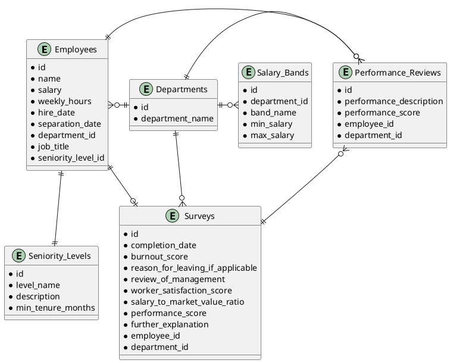
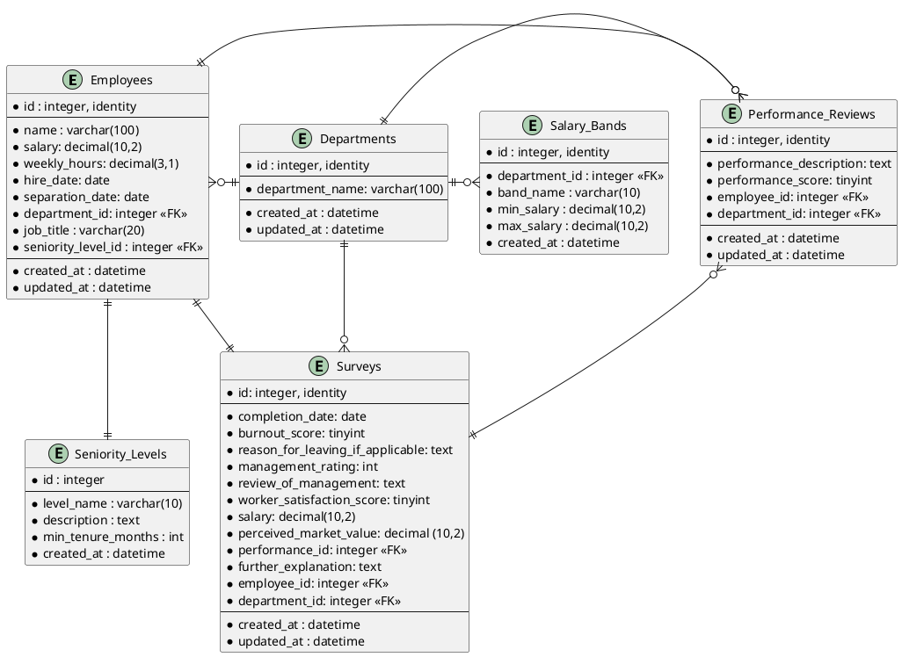

## Employees Analytics Engine ERD

### Logical

```plantuml
@startuml
entity Employees {
     * id
     * name
     * salary
     * weekly_hours
     * hire_date
     * separation_date
     * department_id
     * job_title
     * seniority_level_id
}

entity Departments {
     * id
     * department_name
}

Employees }o-|| Departments

entity Performance_Reviews {
     * id
     * performance_description
     * performance_score
     * employee_id
     * department_id
}

Employees ||-o{ Performance_Reviews
Departments||-o{ Performance_Reviews

entity Surveys {
     * id
     * completion_date
     * burnout_score
     * reason_for_leaving_if_applicable
     * review_of_management
     * worker_satisfaction_score
     * salary_to_market_value_ratio
     * performance_score
     * further_explanation
     * employee_id
     * department_id
}

Employees ||--o| Surveys
Departments||-o{ Surveys
Performance_Reviews }o--|| Surveys

entity Seniority_Levels {
  * id
  * level_name
  * description
  * min_tenure_months
}
Employees ||--|| Seniority_Levels

entity Salary_Bands {
  * id
  * department_id 
  * band_name 
  * min_salary
  * max_salary 
}
 

Departments ||-o{ Salary_Bands


@enduml
```

---

### Physical

```plantuml
@startuml
entity Employees {
     * id : integer, identity
     --
     * name : varchar(100)
     * salary: decimal(10,2)
     * weekly_hours: decimal(3,1)
     * hire_date: date
     * separation_date: date
     * department_id: integer <<FK>>
     * job_title : varchar(20)
     * seniority_level_id : integer <<FK>>
     --
     * created_at : datetime
     * updated_at : datetime
}

entity Departments {
     * id : integer, identity
     --
     * department_name: varchar(100)
     --
     * created_at : datetime
     * updated_at : datetime
}

Employees }o-|| Departments

entity Performance_Reviews {
     * id : integer, identity
     --
     * performance_description: text
     * performance_score: tinyint
     * employee_id: integer <<FK>>
     * department_id: integer <<FK>>
     --
     * created_at : datetime
     * updated_at : datetime
}

Employees ||-o{ Performance_Reviews
Departments||-o{ Performance_Reviews

entity Surveys {
     * id: integer, identity
     --
     * completion_date: date
     * burnout_score: tinyint
     * reason_for_leaving_if_applicable: text
     *management_rating: int
     * review_of_management: text
     * worker_satisfaction_score: tinyint
     * salary: decimal(10,2)
     * perceived_market_value: decimal (10,2)
     * performance_id: integer <<FK>>
     * further_explanation: text
     * employee_id: integer <<FK>>
     * department_id: integer <<FK>>
     --
     * created_at : datetime
     * updated_at : datetime
}

Employees ||--|| Surveys
Departments||-o{ Surveys
Performance_Reviews }o--|| Surveys

entity Seniority_Levels {
  * id : integer
  --
  * level_name : varchar(10)
  * description : text
  * min_tenure_months : int
  * created_at : datetime
}
Employees ||--|| Seniority_Levels

entity Salary_Bands {
  * id : integer, identity
  --
  * department_id : integer <<FK>>
  * band_name : varchar(10)
  * min_salary : decimal(10,2)
  * max_salary : decimal(10,2)
  * created_at : datetime
}

Departments ||-o{ Salary_Bands

@enduml
```
